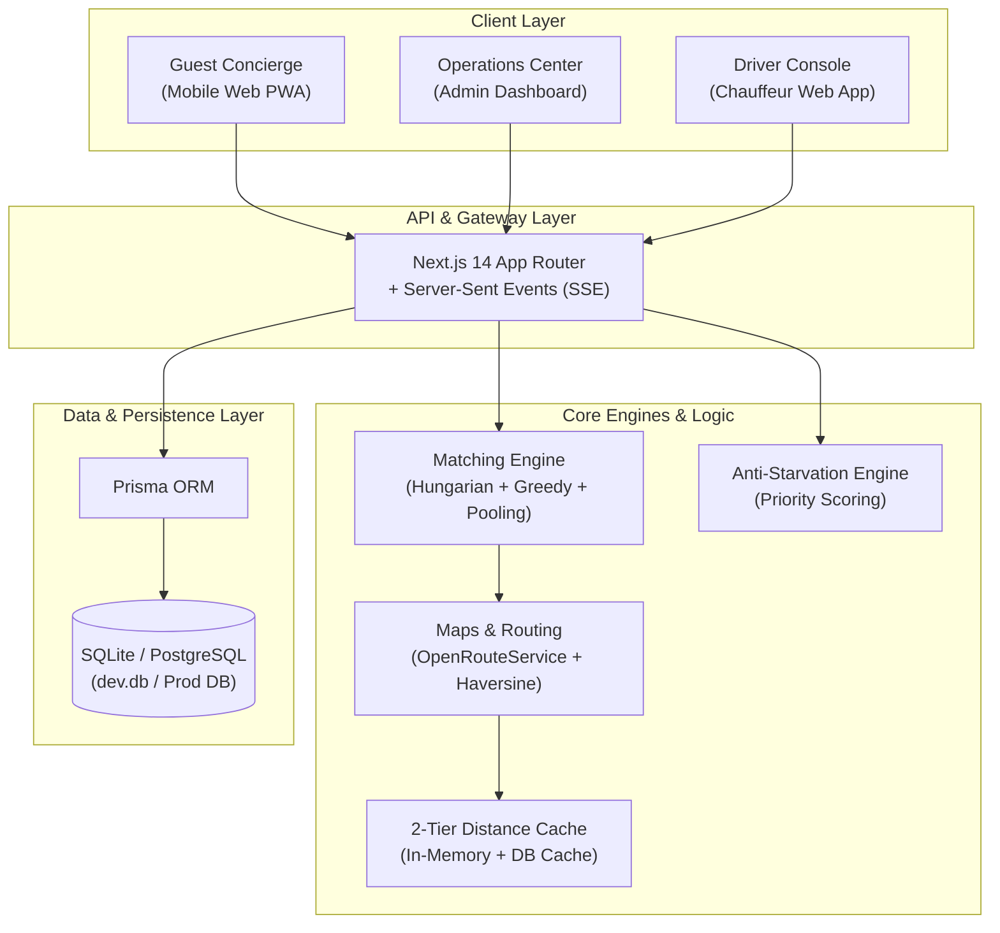

# TBS — Event Transport Dispatch & Royal Hospitality Platform

A mobile-first dispatch and hospitality platform automating vehicle logistics for large-scale group events (weddings, summits, VIP delegations). Built for a single-event private fleet of 10–100 drivers and hundreds of arriving guests in **Delhi, India** (Bharat Mandapam, DEL T3, luxury hotel partners).

---

## 👑 The Bride Side — Royal Luxury Aesthetic

The platform features a custom design system styled for **The Bride Side**, a luxury Indian wedding planning brand:
- **Color Palette**: Royal Velvet Crimson (`#7A1325`, `#5B0E1A`), Imperial Gold (`#D4AF37`, `#E5C158`), and Warm Silk Ivory (`#FFFDF9`).
- **Typography**: Elegant Playfair Display (Serif headings) and Inter (Sans-serif body text).
- **Aceternity UI Components**: `Spotlight` ambient glow effects, `GlowingCard` gradient border hover cards, and `BentoGrid` modular showcases.

---

## 🏗️ High-Level Architecture



---

## ⚡ Matching Engine & Algorithm Specs

The system combines three dispatch strategies to balance operational efficiency and guest satisfaction:

### 1. Pre-Day Batch Dispatch ($O(N^3)$ Hungarian Solver)
* **Algorithm**: Bipartite Matching via the Hungarian Algorithm (`src/lib/matching/hungarian.ts`).
* **Use Case**: Scheduled flight/train arrival batches known in advance.
* **Cost Matrix**:
  $$C_{i,j} = w_1 \cdot d(g_i, d_j) + w_2 \cdot |t_{g_i} - t_{d_j}| + w_3 \cdot \text{WaitTime}(g_i)$$
* **Objective**: Find the global minimum total travel & wait time for all assigned pairs.

### 2. Real-Time On-Demand Dispatch (Greedy Nearest-Neighbor)
* **Algorithm**: Low-latency greedy heuristic (`src/lib/matching/greedy.ts`).
* **Use Case**: Ad-hoc guest ride requests submitted during the event.
* **Selection Metric**: Evaluates available drivers by proximity, vehicle seating capacity, and luggage capacity.

### 3. Multi-Guest Pooling & Detour Constraints
* **Algorithm**: Pooling Engine (`src/lib/matching/pooling.ts`).
* **Constraints Enforced**:
  * Vehicle capacity limit: $\sum \text{GroupSize}_k \le \text{SeatCapacity}_{\text{driver}}$
  * Maximum allowable detour time: $\Delta T_{\text{detour}} \le 15\text{ minutes}$
  * Maximum total delay for any guest: $T_{\text{delay}} \le 20\text{ minutes}$

### 4. Anti-Starvation Mechanism
* **Algorithm**: Priority Queue Engine (`src/lib/matching/priorityQueue.ts`).
* **Formula**:
  $$S(g) = w_1 \cdot T_{\text{wait}} + w_2 \cdot T_{\text{flight\_delay}} - w_3 \cdot D_{\text{detour}}$$
* **Guarantee**: Prevents guests in low-density pickup zones from being repeatedly bypassed by closer arrivals.

---

## 📐 Design Choices & Technical Trade-offs

| Domain | Selected Architecture | Alternative Considered | Engineering Rationale & Trade-off |
|---|---|---|---|
| **Frontend Framework** | Next.js 14 App Router (Responsive PWA) | React Native (Expo Native Apps) | **Choice**: Next.js mobile-first PWA for zero-install instant browser access across iOS and Android guests during a single weekend event. Avoids app store approval delays. |
| **Real-Time Streaming** | Server-Sent Events (SSE) | WebSockets (Socket.IO) | **Choice**: SSE streams real-time map positions and status updates over standard HTTP/2, providing full compatibility with Vercel serverless deployments without requiring persistent proxy servers. |
| **Distance Caching** | 2-Tier In-Memory + Prisma DB Cache | Standalone Redis Cluster | **Choice**: 2-tier caching delivers sub-millisecond lookups locally with zero external server dependencies, achieving a verified $212\times$ API speedup. Upstash Redis `@upstash/redis` can be plugged in for multi-region scale. |
| **Routing Provider** | OpenRouteService + Haversine Fallback | Google Maps Distance Matrix API | **Choice**: OpenRouteService provides free open-source road network routing and polyline generation, backed by a Haversine distance matrix fallback for 100% offline uptime guarantee. |
| **Aesthetics** | The Bride Side Luxury Wedding Theme | Standard Generic UI | **Choice**: Custom royal velvet crimson & imperial gold palette with Aceternity UI components (`Spotlight`, `GlowingCard`, `BentoGrid`) creating a premium wedding concierge feel. |

---

## 📍 Event Locations (Delhi, India Setup)

* **Event Venue**: Bharat Mandapam (Pragati Maidan).
* **Arrival Hubs**:
  * Indira Gandhi International Airport (DEL T3)
  * New Delhi Railway Station (NDLS)
  * Anand Vihar Terminal (ANVT)
* **Partner Accommodations**:
  * Taj Palace (Chanakyapuri)
  * The Leela Palace (New Delhi)
  * ITC Maurya (Diplomatic Enclave)
  * JW Marriott Hotel (Aerocity)

---

## 👥 Role-Based Portals

### 1. Guest Concierge (`/guest`)
- On-demand transfer request form (pickup & dropoff selection).
- Real-time driver map tracking via SSE (`/guest/track`).
- Travel itinerary profile editor (flight number, group size, luggage count).
- Complete transfer history archive.

### 2. Operations Center (`/admin`)
- Fleet Overview Map ([AdminFleetMap.tsx](file:///c:/Users/abhis/Desktop/TBS/src/components/maps/AdminFleetMap.tsx)) rendering live Leaflet vehicle markers and active routes.
- Guest ride request approval queue with one-click dispatch trigger.
- Guest & Chauffeur directories with manual assignment overrides.
- Pre-day Hungarian batch optimization solver console.
- Accommodation lodging manager.

### 3. Royal Chauffeur Console (`/driver`)
- Trip card assignment with accept/reject capability.
- Active navigation view with status progression (`DRIVER_EN_ROUTE` $\rightarrow$ `DRIVER_ARRIVED` $\rightarrow$ `IN_PROGRESS` $\rightarrow$ `COMPLETED`).
- Automatic continuous geolocation tracker (`useLocation.ts`).
- Rest break timer (15, 30, 45 mins) holding new dispatches.

---

## 🛠️ Getting Started & Local Development

### Prerequisites
- Node.js v18+ 
- npm v9+

### Installation & Database Setup
```bash
# 1. Install dependencies
npm install

# 2. Push database schema (SQLite dev environment)
npx prisma db push

# 3. Seed test data (50 guests, 15 drivers, 4 luxury hotels, Delhi coordinates)
npx tsx prisma/seed.ts

# 4. Start local development server
npm run dev
```

The application will be available at `http://localhost:3000`.

### Demo Credentials

| Role | Email | Password | Target View |
|---|---|---|---|
| **Admin Operations** | `admin@tbs.event` | `admin123` | `/admin/dashboard` |
| **Driver Chauffeur** | `driver1@tbs.event` | `driver123` | `/driver/dashboard` |
| **Guest** | `guest1@tbs.event` | `guest123` | `/guest/dashboard` |

---

## 🧪 Simulation & Verification Scripts

```bash
# Run TypeScript type check
npx tsc --noEmit

# Run Maps & Routing Infrastructure Verification
npx tsx src/lib/maps/testMaps.ts

# Run Peak Arrival Window Simulation Test
npx tsx src/lib/simulation/testPeakScenario.ts

# Verify Production Build
npm run build
```

---

## 📄 Deployment

The project is configured for one-click deployment on **Vercel** via `vercel.json`:
- API routes configured with serverless function timeouts.
- Dynamic route headers configured with `export const dynamic = 'force-dynamic'`.
- Static prerendering boundaries configured with React `<Suspense>`.

---

## 📜 License

Distributed under the ISC License. Built for **The Bride Side — Royal Event Transport & Hospitality Concierge**.
