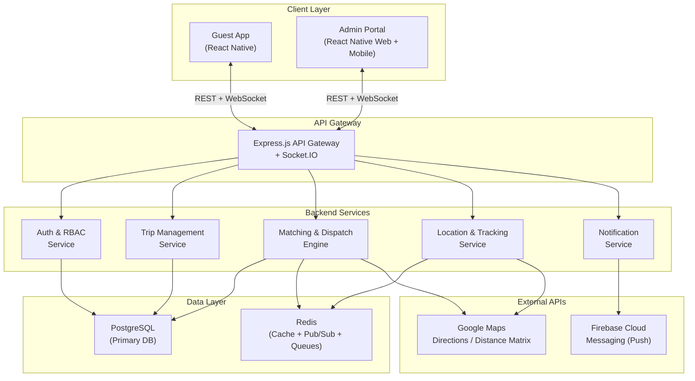
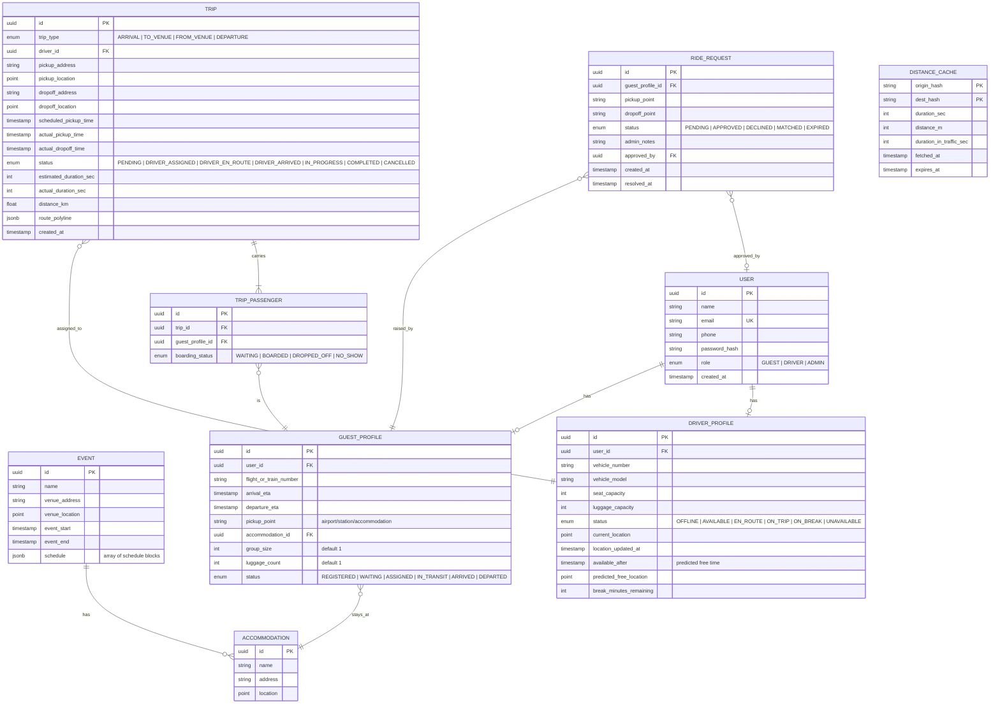
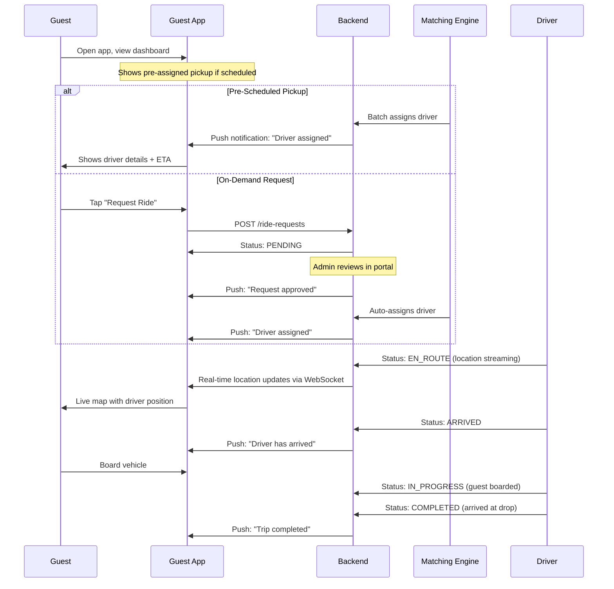
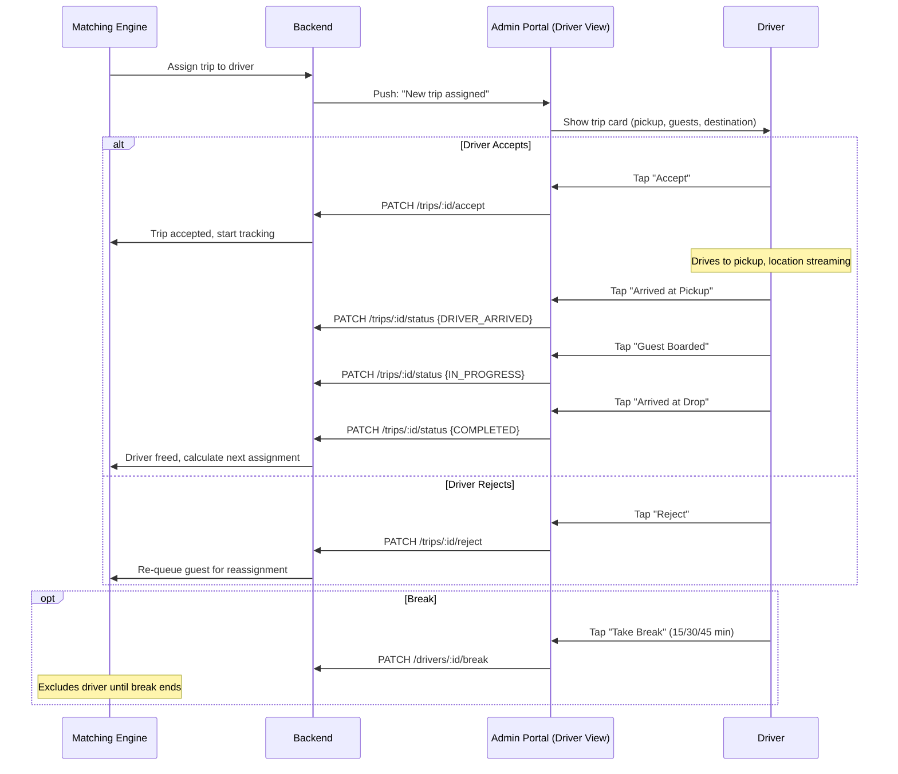
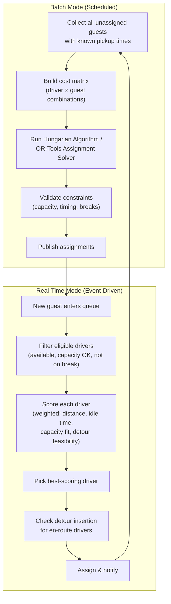
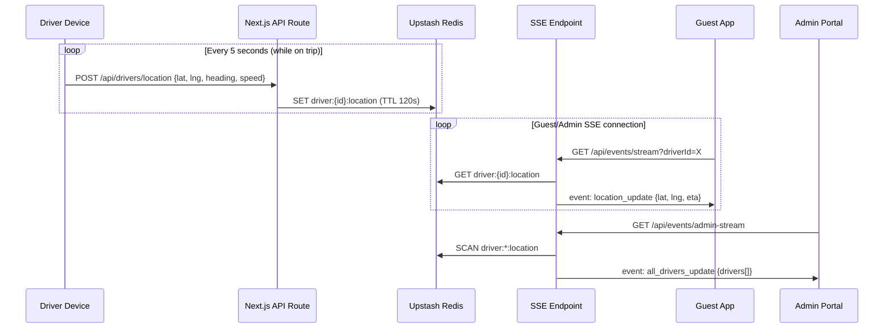

# TBS — Event Transport Dispatch System

A mobile-first dispatch platform automating vehicle logistics for large group events: two apps (Guest App + Admin Portal), a real-time matching engine, and live tracking — designed for a single-event private fleet of 10–100 drivers and a few hundred guests.

---

## High-Level Architecture



---

## Technology Stack

| Layer | Technology | Rationale |
|---|---|---|
| **Guest App** | React Native (Expo) | Cross-platform mobile; fast iteration |
| **Admin Portal** | React Native Web (Expo) | Single codebase serves web + mobile; same project |
| **Backend** | Node.js + Express + TypeScript | Async-friendly, fast to build, good ecosystem |
| **Real-time** | Socket.IO | Bi-directional events for location, status, notifications |
| **Database** | PostgreSQL (via Prisma ORM) | Relational integrity for trips/assignments; PostGIS for geo queries |
| **Cache / Queues** | Redis (Bull queues) | Distance matrix cache, driver state cache, job scheduling |
| **Maps API** | Google Maps (Directions + Distance Matrix) | Industry-standard routing, live traffic, ETA |
| **Push Notifications** | Firebase Cloud Messaging (FCM) | Cross-platform push; free tier sufficient |
| **Auth** | JWT + bcrypt | Lightweight; no OAuth complexity needed for private event |

---

## Data Model



---

## Application Screens & Flows

### Guest App

| Screen | Description |
|---|---|
| **Login / Register** | Phone + OTP or email/password; guest pre-registered by admin, self-registration just links profile |
| **Home / Dashboard** | Current trip status card, upcoming pickup info, quick "Request a Ride" button |
| **Trip Details** | Driver name, vehicle number, plate, seat assignment, live ETA countdown |
| **Live Map** | Full-screen map showing driver's live location, route polyline, pickup/drop pins |
| **Request Ride** | Form: pickup point (dropdown of known locations), destination, group size, luggage; shows "Pending Admin Approval" state |
| **Trip History** | List of completed trips |
| **Profile** | View/edit phone, flight/train details, accommodation |

#### Guest Flow



---

### Admin Portal — Admin/Operations Role

| Screen | Description |
|---|---|
| **Operations Dashboard** | Split-view: left panel = driver list with status badges; right panel = map with all driver positions; top bar = stats (waiting guests, active trips, idle drivers, pending requests) |
| **Guest Management** | Table of all guests: name, status, arrival time, accommodation, assigned driver; filters by status; inline edit for travel detail corrections |
| **Driver Management** | Table of all drivers: name, vehicle, capacity, status, current trip, break time; add/edit/remove drivers |
| **Ride Requests Queue** | List of pending ride requests with guest info, pickup/drop, group size; Approve/Decline buttons with optional notes; approved requests auto-flow to matching engine |
| **Trip Monitor** | List/card view of all active trips; click to see live map, passengers, route, ETA; manual override button to reassign driver |
| **Manual Assignment** | Override modal: select guest(s), select driver from available list, confirm; bypasses matching engine |
| **Batch Planning** | Pre-day view: upload/view guest arrival schedule; trigger batch optimization; review and confirm assignments before publishing |
| **Accommodations** | CRUD for accommodations (name, address, map pin) |

### Admin Portal — Driver Role

| Screen | Description |
|---|---|
| **Driver Dashboard** | Single-trip card: pickup location, guest name(s), guest count, destination, target time; Accept / Reject buttons |
| **Active Trip View** | Full-screen map with route, pickup pin, drop pin; status buttons: "Arrived at Pickup" → "Guest Boarded" → "Arrived at Drop" |
| **Break Timer** | After completing a trip, driver can mark "Taking Break" with a timer; system respects this before next assignment |
| **Trip History** | List of completed trips for the driver |

#### Driver Flow



---

## Matching & Dispatch Engine — Algorithm Design

### Overview

The matching engine operates in **two modes** that run concurrently:

1. **Batch Mode** — runs pre-event and at configurable intervals (e.g., every 15 min), optimizes all pending assignments using a solver
2. **Real-Time Mode** — triggered immediately when a new guest enters the queue (admin-approved request, or a scheduled pickup window opening), uses a fast greedy heuristic



### Cost / Scoring Function

Each potential (driver, guest) pairing is scored. **Lower cost = better match.**

```
Cost(driver, guest) =
    w1 × travel_time_to_pickup(driver.location, guest.pickup, traffic)
  + w2 × guest.wait_time_so_far          // penalize long waits (starvation prevention)
  + w3 × capacity_waste(driver, guest)    // prefer snug fits
  + w4 × break_violation_penalty          // if driver hasn't had mandated rest
  + w5 × detour_penalty                   // extra time if inserting into existing route
  - w6 × destination_cluster_bonus        // reward grouping same-destination guests
```

| Weight | Default | Purpose |
|---|---|---|
| `w1` | 1.0 | Minimize driver travel to pickup |
| `w2` | 2.0 | Prevent guest starvation (higher = more aggressive anti-starvation) |
| `w3` | 0.5 | Prefer vehicles sized close to the group |
| `w4` | 5.0 | Strongly discourage skipping breaks |
| `w5` | 1.5 | Penalize excessive detours |
| `w6` | 1.0 | Incentivize shared rides to same destination |

### Batch Assignment (Pre-Day)

1. Collect all guests with `arrival_eta` in the upcoming window
2. Cluster guests by **destination** (accommodation) and **arrival time** (±30 min window)
3. For each cluster, attempt to fill vehicles greedily by capacity (bin-packing)
4. Build a bipartite cost matrix: rows = drivers, columns = guest-clusters
5. Solve assignment using the **Hungarian algorithm** (O(n³), fine for n ≤ 100)
6. Validate: no capacity overflows, all timing constraints met
7. Publish assignments; notify drivers and guests

### Real-Time Greedy Match

1. Guest enters the real-time queue (admin approval, or scheduled window opens)
2. Filter drivers: `status IN (AVAILABLE, EN_ROUTE)` AND `remaining_capacity >= guest.group_size`
3. For `AVAILABLE` drivers: compute `travel_time(driver.location → guest.pickup)` from cache or API
4. For `EN_ROUTE` drivers: evaluate **detour insertion** (see below)
5. Score all eligible drivers; pick the lowest-cost
6. If no driver available: add to priority queue sorted by `wait_time`; re-evaluate on next driver-freed event

### Opportunistic Detour Insertion

When a driver is `EN_ROUTE` with remaining capacity:

1. Compute current route: `driver.location → existing_dropoff(s)`
2. Compute detour route: `driver.location → new_pickup → new_dropoff → remaining_dropoffs`
3. Calculate `detour_time = new_route_time - original_route_time`
4. Accept if:
   - `detour_time ≤ MAX_DETOUR_MINUTES` (configurable, default 10 min)
   - No existing passenger's ETA is violated by more than `MAX_ETA_SLIP` (default 5 min)
   - Remaining capacity ≥ new guest's group_size + luggage

### Continuous Re-Optimization

- Every **5 minutes**, a background job re-fetches traffic-aware ETAs for all active trips
- If any trip's ETA has drifted by more than **10 minutes** from the original estimate:
  - Notify affected guests with updated ETA
  - If a re-route would be faster, update the driver's navigation
  - If a different driver is now significantly better for a pending assignment, consider reassignment (only if the original driver hasn't started the pickup yet)

### Starvation Prevention

- Guests in the queue have a monotonically increasing `wait_time` score
- The `w2` weight ensures that long-waiting guests rapidly rise in priority
- A hard cap: if `wait_time > MAX_WAIT_MINUTES` (default 20 min), the system:
  1. Alerts the admin dashboard with a ⚠️ warning
  2. Expands the search radius for available drivers
  3. Considers pulling a driver from a lower-priority scheduled trip

### Handling Large Groups

- If `guest.group_size > max(all_drivers.seat_capacity)`:
  1. Split the group into sub-groups that fit available vehicles
  2. Assign multiple drivers
  3. Coordinate departure so all sub-group vehicles leave together
  4. Guest app shows "Your group has 2 vehicles" with both driver details

---

### Real-Time Location & Tracking



- Driver location is stored in **Upstash Redis** (hot data, TTL 120s)
- Location updates are sent via **POST API** (Vercel-compatible, no WebSocket needed)
- Guest app connects to an **SSE endpoint** that streams their assigned driver's location every 3 seconds
- Admin dashboard connects to an **SSE endpoint** streaming all driver positions
- Historical track points are batch-written to **PostgreSQL** every 30 seconds

---

## API Design (Key Endpoints)

### Auth
| Method | Endpoint | Description |
|---|---|---|
| POST | `/api/auth/login` | Email/password login, returns JWT + role |
| POST | `/api/auth/refresh` | Refresh token |
| GET | `/api/auth/session` | Get current session/user info |

### Guests
| Method | Endpoint | Description |
|---|---|---|
| GET | `/api/guests` | List all guests (Admin only) |
| GET | `/api/guests/:id` | Guest profile (self or Admin) |
| PUT | `/api/guests/:id` | Update guest travel details (self or Admin) |
| GET | `/api/guests/:id/trip` | Current active trip for guest |

### Drivers
| Method | Endpoint | Description |
|---|---|---|
| GET | `/api/drivers` | List all drivers (Admin only) |
| POST | `/api/drivers` | Add driver (Admin only) |
| PUT | `/api/drivers/:id` | Update driver details (Admin only) |
| PATCH | `/api/drivers/:id/status` | Update driver status (Driver self) |
| PATCH | `/api/drivers/:id/location` | Update location (Driver self, also via WS) |
| PATCH | `/api/drivers/:id/break` | Start/end break (Driver self) |

### Trips
| Method | Endpoint | Description |
|---|---|---|
| GET | `/api/trips` | List trips with filters (Admin only) |
| GET | `/api/trips/:id` | Trip details (assigned driver or admin) |
| PATCH | `/api/trips/:id/accept` | Driver accepts trip |
| PATCH | `/api/trips/:id/reject` | Driver rejects trip |
| PATCH | `/api/trips/:id/status` | Update trip status (Driver) |
| POST | `/api/trips/manual-assign` | Manual override assignment (Admin) |

### Ride Requests
| Method | Endpoint | Description |
|---|---|---|
| POST | `/api/ride-requests` | Guest raises request |
| GET | `/api/ride-requests` | List pending requests (Admin) |
| PATCH | `/api/ride-requests/:id/approve` | Admin approves → triggers matching |
| PATCH | `/api/ride-requests/:id/decline` | Admin declines with reason |

### Matching Engine
| Method | Endpoint | Description |
|---|---|---|
| POST | `/api/dispatch/batch` | Trigger batch optimization (Admin) |
| GET | `/api/dispatch/status` | Engine health & queue stats (Admin) |

### SSE Event Streams
| Endpoint | Consumer | Events Streamed |
|---|---|---|
| `GET /api/events/stream?driverId=X` | Guest App | `location_update`, `trip_status`, `eta_update` |
| `GET /api/events/driver-stream` | Driver Portal | `trip_assigned`, `trip_cancelled` |
| `GET /api/events/admin-stream` | Admin Portal | `all_drivers_update`, `new_request`, `alert`, `stats_update` |

### Location Push (Driver → Server)
| Method | Endpoint | Payload |
|---|---|---|
| POST | `/api/drivers/location` | `{lat, lng, heading, speed, timestamp}` |

---

## Project Structure

```
TBS/
├── src/
│   ├── app/                            # Next.js App Router
│   │   ├── layout.tsx                  # Root layout (fonts, providers)
│   │   ├── page.tsx                    # Landing / role redirect
│   │   │
│   │   ├── (auth)/                     # Auth pages (public)
│   │   │   ├── login/page.tsx
│   │   │   └── register/page.tsx
│   │   │
│   │   ├── guest/                      # Guest App pages
│   │   │   ├── layout.tsx              # Guest layout (nav, auth guard)
│   │   │   ├── dashboard/page.tsx      # Home — trip status, upcoming
│   │   │   ├── track/page.tsx          # Live map tracking
│   │   │   ├── request/page.tsx        # Request a ride
│   │   │   ├── history/page.tsx        # Trip history
│   │   │   └── profile/page.tsx        # Edit profile / travel details
│   │   │
│   │   ├── admin/                      # Admin Portal pages
│   │   │   ├── layout.tsx              # Admin layout (sidebar, auth guard)
│   │   │   ├── dashboard/page.tsx      # Ops dashboard (map + driver list)
│   │   │   ├── guests/page.tsx         # Guest management table
│   │   │   ├── drivers/page.tsx        # Driver management
│   │   │   ├── requests/page.tsx       # Ride request queue
│   │   │   ├── trips/page.tsx          # Trip monitor
│   │   │   ├── batch/page.tsx          # Batch planning
│   │   │   └── accommodations/page.tsx
│   │   │
│   │   ├── driver/                     # Driver Portal pages
│   │   │   ├── layout.tsx              # Driver layout (minimal nav, auth guard)
│   │   │   ├── dashboard/page.tsx      # Current trip card
│   │   │   ├── trip/page.tsx           # Active trip map + status buttons
│   │   │   ├── break/page.tsx          # Break timer
│   │   │   └── history/page.tsx        # Trip history
│   │   │
│   │   └── api/                        # API Routes (serverless)
│   │       ├── auth/
│   │       │   ├── login/route.ts
│   │       │   ├── register/route.ts
│   │       │   └── session/route.ts
│   │       ├── guests/
│   │       │   ├── route.ts            # GET (list), POST (create)
│   │       │   └── [id]/route.ts       # GET, PUT, DELETE
│   │       ├── drivers/
│   │       │   ├── route.ts
│   │       │   ├── [id]/route.ts
│   │       │   ├── [id]/status/route.ts
│   │       │   ├── [id]/break/route.ts
│   │       │   └── location/route.ts   # POST location update
│   │       ├── trips/
│   │       │   ├── route.ts
│   │       │   ├── [id]/route.ts
│   │       │   ├── [id]/accept/route.ts
│   │       │   ├── [id]/reject/route.ts
│   │       │   └── [id]/status/route.ts
│   │       ├── ride-requests/
│   │       │   ├── route.ts
│   │       │   ├── [id]/approve/route.ts
│   │       │   └── [id]/decline/route.ts
│   │       ├── dispatch/
│   │       │   ├── batch/route.ts
│   │       │   └── status/route.ts
│   │       └── events/
│   │           ├── stream/route.ts     # SSE: guest location/trip updates
│   │           ├── driver-stream/route.ts  # SSE: driver trip assignments
│   │           └── admin-stream/route.ts   # SSE: admin dashboard feed
│   │
│   ├── components/                     # Shared React components
│   │   ├── ui/                         # Design system (buttons, cards, etc.)
│   │   ├── maps/                       # Map components (Leaflet)
│   │   ├── guest/                      # Guest-specific components
│   │   ├── admin/                      # Admin-specific components
│   │   └── driver/                     # Driver-specific components
│   │
│   ├── lib/                            # Backend logic (runs in API routes)
│   │   ├── db/
│   │   │   └── prisma.ts               # Prisma client singleton
│   │   ├── auth/
│   │   │   ├── session.ts              # JWT session management
│   │   │   └── rbac.ts                 # Role-based access control
│   │   ├── matching/
│   │   │   ├── engine.ts               # Matching engine orchestrator
│   │   │   ├── batchSolver.ts          # Hungarian algorithm
│   │   │   ├── greedyMatcher.ts        # Real-time greedy
│   │   │   ├── detourEvaluator.ts      # Detour insertion logic
│   │   │   ├── costFunction.ts         # Scoring / cost computation
│   │   │   └── starvationGuard.ts      # Wait-time escalation
│   │   ├── maps/
│   │   │   ├── openRouteService.ts      # ORS API wrapper
│   │   │   ├── haversine.ts            # Fallback distance calc
│   │   │   └── distanceCache.ts        # Redis-backed cache
│   │   ├── trips/
│   │   │   └── tripManager.ts          # Trip lifecycle management
│   │   └── notifications/
│   │       └── inAppNotifier.ts        # SSE-based notifications
│   │
│   ├── hooks/                          # React hooks
│   │   ├── useSSE.ts                   # SSE connection hook
│   │   ├── useAuth.ts                  # Auth state hook
│   │   └── useLocation.ts             # Geolocation hook (driver)
│   │
│   ├── stores/                         # Zustand state stores
│   │   ├── authStore.ts
│   │   ├── tripStore.ts
│   │   └── locationStore.ts
│   │
│   └── types/                          # Shared TypeScript types
│       └── index.ts
│
├── prisma/
│   ├── schema.prisma                   # Database schema
│   ├── seed.ts                         # Seed data (50 guests, 15 drivers, etc.)
│   └── migrations/
│
├── public/                             # Static assets
├── docs/
│   └── matching-algorithm.md           # Design document (deliverable #4)
│
├── next.config.js
├── tailwind.config.ts                  # NOT using Tailwind — vanilla CSS
├── tsconfig.json
├── package.json
├── vercel.json                         # Vercel deployment config
└── README.md
```

---

## Key Trade-Offs & Design Decisions

### 1. Monolith Backend vs. Microservices

**Decision: Modular monolith.**

At the scale of 10–100 drivers and a few hundred guests, microservices add operational complexity (service discovery, inter-service communication, deployment orchestration) without proportional benefit. The backend is a single deployable Node.js server with clear internal module boundaries (`services/matching/`, `services/location/`, etc.). If scale demands later, the matching engine could be extracted.

### 2. Hungarian Algorithm vs. Simpler Heuristics for Batch

**Decision: Hungarian for batch, greedy for real-time.**

- Batch runs are infrequent (pre-day + every 15 min) and the matrix size is small (≤ 100 × 100), so O(n³) is perfectly feasible.
- Real-time matches need sub-second response; a scored greedy approach is sufficient and predictable.
- We avoid OR-Tools to reduce dependency complexity; the problem structure (bipartite assignment) is a natural fit for Hungarian.

### 3. Single Next.js App with Role-Based Routing

**Decision: One Next.js app, three route groups (`/guest`, `/admin`, `/driver`).**

- Guest experience stays clean and minimal — completely separate routes and layout.
- Admin and Driver share the portal branding but have completely isolated route groups gated by RBAC middleware.
- Single Vercel deployment = one project, one URL, shared backend API routes.
- Next.js App Router's layout nesting makes role isolation clean: each route group has its own `layout.tsx` with auth guards.

### 4. OpenRouteService vs. Google Maps

**Decision: OpenRouteService (OSRM-based) with Haversine fallback.**

- **Pros**: Free, no API key required, open-source, no billing surprises.
- **Cons**: No real-time traffic data (OSRM uses static road speeds), less accurate ETAs during peak hours, rate-limited (40 req/min for directions on free API).
- **Mitigation**: Aggressive caching of known-location distances; Haversine fallback if ORS is unavailable; batch distance matrix requests.
- **Trade-off accepted**: Slightly less accurate ETAs in exchange for zero API cost and no vendor lock-in. For a private event with known routes, static road speeds are usually sufficient.
- Static distances between known locations (airport, station, accommodations, venue) are pre-computed once and cached in Redis + PostgreSQL.

### 5. SSE + Polling vs. WebSockets

**Decision: Server-Sent Events for server→client, REST POST for client→server.**

- Vercel serverless functions don't support persistent WebSocket connections.
- SSE works over standard HTTP and is fully Vercel-compatible (streaming responses).
- Driver location updates are sent via POST (every 5 seconds) — simple, reliable.
- Guest/Admin receive updates via SSE stream — server pushes data as it arrives.
- **Trade-off**: Slightly higher latency (~1-3s) compared to WebSockets; acceptable for this use case.

### 6. Graceful Degradation

- If the matching engine is down: admin can still manually assign via the portal (bypass endpoint doesn't touch the engine).
- If Redis is down: location updates fall back to direct PostgreSQL writes (slower, but functional); cached distances degrade to re-fetching from ORS.
- If OpenRouteService API is unavailable: system falls back to Haversine (straight-line) distance estimates with a configurable speed factor (default 40 km/h for urban driving).

---

## Implementation Phases

### Phase 1 — Foundation
- [ ] Initialize Next.js 14 project with App Router
- [ ] Prisma setup + PostgreSQL schema (all models)
- [ ] Seed script (50 guests, 15 drivers, 3 accommodations, 1 venue)
- [ ] Auth system (JWT login, RBAC middleware)
- [ ] Basic CRUD API routes: guests, drivers, accommodations, trips
- [ ] Design system (CSS variables, component library)

### Phase 2 — Guest App
- [ ] Login/register pages
- [ ] Dashboard with trip status card
- [ ] Trip detail with driver info
- [ ] Ride request form + pending state
- [ ] Live map tracking (Leaflet + SSE)
- [ ] Profile / travel details page

### Phase 3 — Admin Portal
- [ ] Role-based login + layout routing
- [ ] Admin: Operations dashboard (driver list + map)
- [ ] Admin: Guest management table
- [ ] Admin: Driver onboarding (add/edit/remove)
- [ ] Admin: Ride request approval queue
- [ ] Admin: Trip monitor
- [ ] Admin: Manual override assignment modal
- [ ] Admin: Batch planning page

### Phase 4 — Driver Portal
- [ ] Driver: Trip card + accept/reject
- [ ] Driver: Active trip map + status progression
- [ ] Driver: Break timer
- [ ] Driver: Trip history
- [ ] Driver: Location sharing (Geolocation API → POST)

### Phase 5 — Matching Engine
- [ ] Cost function implementation
- [ ] Greedy real-time matcher
- [ ] Hungarian batch solver
- [ ] Detour evaluator (en-route insertion)
- [ ] Starvation guard
- [ ] Integration with trip lifecycle

### Phase 6 — Maps & Real-Time
- [ ] OpenRouteService API integration (Directions + Matrix)
- [ ] Haversine fallback
- [ ] Distance cache (Redis/in-memory)
- [ ] Driver location POST → Redis storage
- [ ] SSE streams (guest, driver, admin)
- [ ] Guest live map with driver position + ETA
- [ ] Admin dashboard map with all drivers

### Phase 7 — Polish & Edge Cases
- [ ] Large group split-and-coordinate
- [ ] Continuous re-optimization on traffic changes
- [ ] Graceful degradation paths
- [ ] Notification refinement (arrival alerts, ETA updates)
- [ ] UI polish, animations, responsive layout
- [ ] Error handling, loading states, empty states

### Phase 8 — Testing, Deployment & Documentation
- [ ] Unit tests for matching engine (capacity, starvation, detour)
- [ ] Integration tests for trip lifecycle
- [ ] Simulated peak-arrival scenario test
- [ ] Design document (`docs/matching-algorithm.md`)
- [ ] README with setup instructions
- [ ] Vercel deployment configuration
- [ ] `vercel.json` + environment variable setup

---

## Resolved Decisions

| Question | Decision |
|---|---|
| **Maps Provider** | OpenRouteService (OSRM-based) — free, no API key, open-source. Haversine fallback. Trade-off: no live traffic data. |
| **Deployment** | Vercel — single Next.js app, serverless functions, edge network. |
| **Seed Data** | Yes — 50 guests (staggered arrivals), 15 drivers (varying capacities), 3 accommodations, 1 venue. |
| **Push Notifications** | In-app via SSE — no Firebase dependency. |
| **Real-time Transport** | SSE (server→client) + REST POST (client→server) — Vercel-compatible, no WebSocket needed. |

---

## Verification Plan

### Automated Tests
- `npm test` — Unit tests for matching engine (Jest)
  - Capacity constraint validation
  - Starvation prevention (guest waiting > threshold gets priority)
  - Detour insertion correctness
  - Hungarian solver optimality vs. greedy baseline
- `npm run test:integration` — API integration tests
  - Full trip lifecycle: create → assign → accept → pickup → drop → complete
  - RBAC enforcement: driver cannot access admin endpoints
  - Ride request flow: create → approve → auto-match

### Manual Verification
- Simulated peak scenario: 30 guests arriving within a 1-hour window, 10 drivers
- Verify no guest waits > 20 minutes
- Verify no driver is idle while guests are waiting
- Verify capacity is never exceeded
- Test driver rejection → automatic reassignment
- Test admin manual override
- Test mid-trip detour insertion
